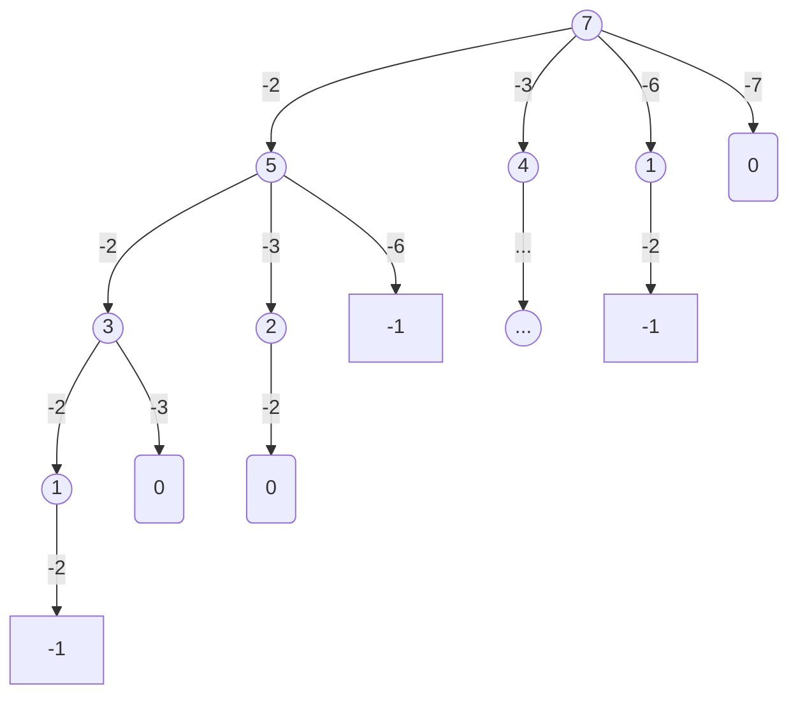
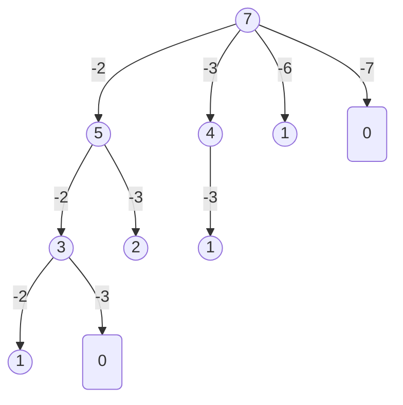

39   
===

# 解答

以 `2 3 6 7` 和 `7` 为例，圆角矩形为的值为 0，说明到此节点可以将结果添加到集合里，如果是方角矩形即值小于0，则直接舍弃。同时要注意到这里的结果是有重复的，即 `2 2 3`和 `2 3 2` 重复，所以我们要进行剪枝，即每次减的数不能比上次的小。



于是我们每次减的数不大于当前值且不小于上次减的数，故可以得到如下的搜索树



结果即 `2 2 3` 和 `7` 


```java
class Solution {
    public List<List<Integer>> combinationSum(int[] candidates, int target) {
        List<List<Integer>> result = new ArrayList<>();

        if (candidates == null || candidates.length < 1) {
            return result;
        }

        Arrays.sort(candidates);

        List<Integer> list = new ArrayList<>();
        dec(candidates, 0, target, list, result);

        return result;
    }

    public static void dec(int[] candidates, int start, int curVal, List<Integer> list, List<List<Integer>> result) {
        if (curVal == 0) {
            result.add(new ArrayList<>(list));
            return;
        }

        for (int i = start, len = candidates.length; i < len && candidates[i] <= curVal; i++) {
            list.add(candidates[i]);
            dec(candidates, i, curVal - candidates[i], list, result);
            list.remove(list.size() - 1);
        }
    }
}
```

